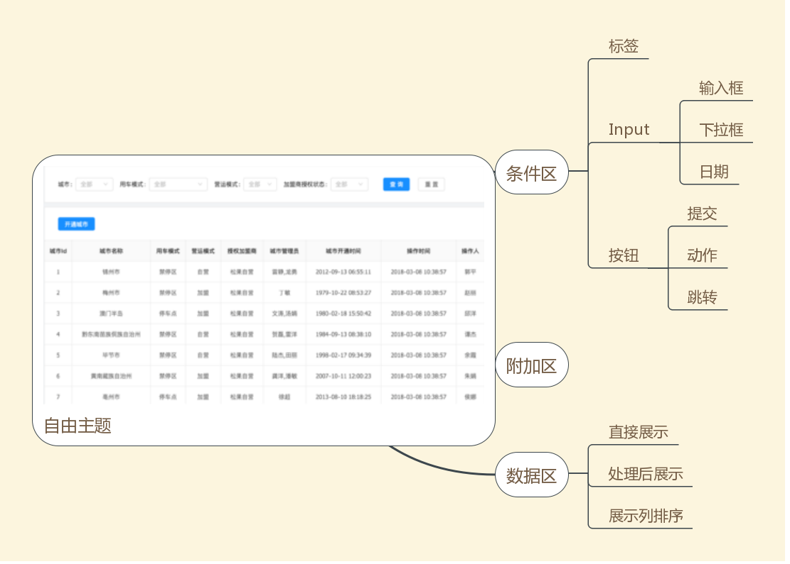

# react-search-table



#### 数据结构
```
search-table {
  // 条件区
  search:[
    {
      [label:'demo',]
      [placeholder:'请输入',]
      type:'text|select|date|button',
      [select:[
        {
          key: 0,
          value: '项目一'
        }
      ]],
      [button:[
        {
          text:'提交',
          type:"submit|redirect|action"
          submit:()=>{

          }
        }
      ]]
    }
  ],
  // 附加区 - 换页触发
  onchange:(pagedata)=>{

  },

  // 数据区
  header:['姓名','电话', '性别'],
  data:[
    {
      id: 'name',
      name: '姓名',
    },{
      id: 'tel',
      name: '电话',
      render:(val,record)=>{

      }
    }
  ]
}
```